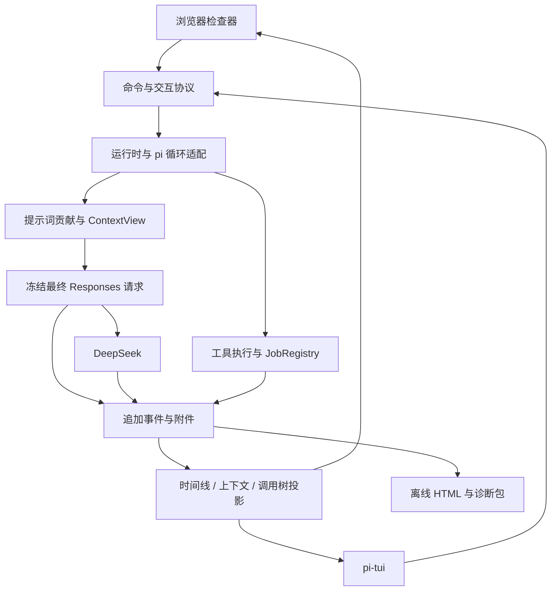

# Harness 架构与技术选型研究

> **定制能力更新（2026-09-22）**：本地 TS 扩展、Skills、Rules、MCP 工具和声明式 Web UI 已进入 V1 实现与验收，见 [V1 归档](openspec/changes/archive/2026-09-22-enable-user-customization-mvp/proposal.md) 与 [验收记录](docs/customization-v1-validation.md)。V2 已实现 Provider、持久工作流、静态组件 UI、包分发、MCP 内容/OAuth 与进程隔离，并通过部分组合验收；V1 已验收归档，V2 在 `deliver-customization-v2` 中实施，0.2.0 尚未通过完整候选门槛。下文为历史研究，不代表这些未来能力已经交付。

> **验证更新（2026-09-15）**：下文保留原研究，落地以 [验证报告](docs/validation/2026-09-15/README.md) 和 [首阶段 OpenSpec proposal](openspec/changes/establish-observable-headless-core/proposal.md) 为准。已验证 pi 0.85.1 公开低层循环及 Responses 扩展点，首版复用 parser、自有证据层；实测补充 thinking/tool_choice、developer 指令和 reasoning 回传限制。pi edit 的隐式模糊回退不作为本项目默认行为。提示词胜率、产品持久化和跨平台验收仍需后续实现与实验。

## 1. 决策摘要

建议采用 **pi-agent-core 作为可替换的 agent loop，自有事件账本作为产品内核，独立 DeepSeek Responses adapter 作为模型边界**。提示词与基础工具优先采用 pi 的设计方式，上下文投影吸收 dsh 的事件化模型，缓存诊断和请求预算吸收 Deepy 的已有实现。浏览器优先，pi-tui 后续连接同一运行时。Skills、Rules、MCP 作为能力层，subagent 作为拥有独立会话的执行单元。

这是相对于“沿用 OpenAI Agents SDK TS”的选型调整：在可观测性、pi 提示词和工具设计成为最高优先级后，迁移 Python SDK 概念的收益降低，控制消息进入模型的全过程更重要。框架只拥有循环机制；持久化、请求证据、上下文策略和业务命令属于 Harness。

| 优先级 | 目标 | 建议边界 |
|---|---|---|
| P0 | 任意调用可解释、可检查、可导出 | 事件账本、最终请求、原始流、工具证据、提示词来源 |
| P0 | 提示词和工具容易被模型正确使用 | pi 风格短主提示词、工具贡献提示、简单工具 schema |
| P1 | 浏览器和 TUI 一致 | 同一运行时、命令协议、事件投影与交互请求 |
| P2 | Skills / Rules / MCP | 标准格式、独立发现与执行、按需加载、版本快照 |
| P2 | 长任务与成本 | 稳定请求前缀、非破坏性上下文投影、缓存诊断 |
| P3 | subagents / 后台任务 / 审批 | 重新设计运行生命周期，按需要迁移已有策略 |
| P3 | skill 市场 | 复用现有服务端 HTTP 契约，重写 TS 客户端 |

### 研究边界

资料核对日期为 2026-09-15。Deepy 基于本地 commit `a7ba8ad59cf9a728e6ce47d0fd3e74c96c3c9aee` 的代码；pi 与 dsh 基于官方仓库当时可访问的主分支和文档，主分支能力不等于 npm 已发布能力。本报告没有提供真实模型调用、性能或任务成功率实测。下文区分“已核实事实”和“建议设计”，所有阈值和原型方案均是待验证建议。

## 2. pi、dsh 与 Deepy 的参考分工

### pi：提示词、工具接口、轻量循环与交互

pi 当前主提示词按启用工具生成工具列表与指导，工具可贡献 `promptSnippet` 和 `promptGuidelines`。`read`、`edit` 等工具因此拥有自己的模型使用说明，避免主提示词与工具实现分开演进。自定义主提示词与默认提示词存在不同组装路径，不能假定替换身份文字后其余默认指导自动保留。[1][2]

建议采用这种贡献式设计，但不直接复制包含 pi 自身身份和文档导航的全部提示词。应把“提示词较短、职责清楚”视为可维护性优势；是否提高 DeepSeek 的任务完成率，需要独立对照实验。

### dsh：可回放事实、上下文投影与长任务

dsh 的会话模型区分不可变事件记录和模型当前可见的消息投影，后者称为 surface。摘要或裁剪以新的替换事件描述，不要求删除原始记录；请求配置和工具定义也进入日志。[3] 这种分离非常契合可观测性优先的 Harness。

不建议第一版完整引入 dsh 的 Cordis 插件体系。其“一切皆插件”提供很强的可组合性，但也要求理解作用域、挂载、服务、事件链和生命周期。dsh 官方明确处于 developer preview，存在破坏性变化。[4] 建议先借鉴少数稳定边界，再评估是否值得直接使用整个宿主。

### Deepy：保留精细技术，而非所有产品行为

本地 `cache_context.py` 已有请求前缀快照、fingerprint、变化原因和缓存统计；`compaction.py` 有预算检查、历史 revision 检查和原始历史保留；`history_projection.py` 管理目标模型历史。应迁移这些约束和测试场景。

主提示词中固定的 todo/subagent 路由、特定审批措辞、整套工具 JSON 包装，不建议作为必须兼容的外部合约。它们可以根据新工具体系重写。

## 3. 第一目标：可观测性必须覆盖三条链

### 3.1 提示词与上下文链

需要回答：模型看到的每段内容从哪里来、何时加入、由谁修改、在哪次请求生效、何时被压缩或撤销。

建议记录：

- 主提示词模板版本和内容 hash；
- 工具贡献的提示词片段与 schema 版本；
- Rules 的路径、内容快照、适用范围；
- Skills 的目录快照和实际读取内容；
- 用户输入、steering、后台任务通知与子任务返回；
- 插件转换前后的 hash、执行顺序和转换理由；
- 当前请求引用的上下文节点及其顺序。

### 3.2 模型请求链

需要记录最终序列化请求、脱敏后的响应头、原始 SSE 事件、失败响应体、每次 attempt、最终 response 和 usage。

pi 的 `before_provider_request` 可修改实际请求，而 `getSystemPrompt()` 不包含这些后续修改。这说明只导出主提示词不足以证明模型收到的输入。[5] 建议在所有中间件执行完毕后冻结请求，再由唯一 transport 发出；observer 不能继续修改请求。传输层捕获响应必须有背压和内存边界，避免独立消费分支无限缓存流数据。

SDK 内部自动重试若未暴露 attempt，应该关闭并交给 adapter 统一调度。逻辑调用和网络 attempt 分开编号，取消、限流、断流也都属于记录范围。主对话、compact、subagent、标题生成等都通过同一模型入口，禁止辅助功能另建无法追踪的客户端。

### 3.3 工具执行链

需要记录模型原始参数、参数归一化、权限判断、实际执行参数、cwd、开始与完成、stdout/stderr、结果裁剪、文件 diff 和模型最终收到的结果。

建议将工具结果拆成三个视图：

| 视图 | 内容 | 使用方 |
|---|---|---|
| 模型结果 | 简短文本、必要图片、继续读取指引 | 下一次模型调用 |
| 展示结果 | diff、文件路径、进度、exit code | Web / TUI |
| 执行证据 | 完整输出、原始参数、修改前后 hash | 日志、导出、诊断 |

pi 的 edit 已把简短成功消息放在 `content`，把 diff/patch 放在 `details`，这是可直接参考的边界。[2] Harness 应进一步明确模型结果与完整执行证据的关联。

### 3.4 日志与 telemetry 分工

pi-telemetry 明确把 span 定义为诊断数据，提供无后端绑定的接口和内存参考实现；记录失败不应改变业务结果。[6] 这适合性能观测，但不应承担唯一持久事实记录。

建议分开：

- **Journal**：不可采样的业务事实和调用证据；持久化失败后停止启动新的副作用操作。
- **Telemetry**：耗时、队列长度、计数等诊断；后端失败不会中断任务。

模型和工具已经开始执行时，日志失败应尝试取消、记录可获得的证据并标记不完整，不能声称已执行副作用被撤销。

### 3.5 存储、崩溃与导出

建议 `journal.jsonl` 为唯一权威事件序列，`artifacts/` 保存大内容，SQLite 只存可重建索引。事件有 `schemaVersion / eventId / seq / timestamp / sessionId / runId / attemptId / toolCallId`；跨 session 用稳定 ID 关联，不用时间戳推断因果。

流事件使用小批量追加，记录已持久化水位。关键 dispatch/commit 边界刷盘；需区分已写入进程缓冲、已交给操作系统、已完成 fsync。无法承诺断电下每个最后 token 都留存，验收应规定最大丢失窗口和恢复标记。

dsh 当前文档说明实时流在 settlement 时进入持久 assistant 记录，进程在 settlement 前丢失会留下流记录缺口。[7] Harness 的最高优先级要求比此更强，应在运行中持续记录。

导出分两类：

1. HTML：离线阅读时间线、请求、提示词来源、工具结果、缓存变化；不访问外部脚本或资源。
2. 诊断包：JSONL、附件、manifest、版本与 hash，可做完整性检查和回放。

对 HTML 做转义与内容隔离，避免模型输出成为可执行脚本。导入只恢复状态，不执行工具；脱敏导出应明确标记删减，不冒充可精确继续的完整会话。回放 UI、重新发模型请求、重跑工具是三个独立操作。

## 4. 提示词重构：采用 pi 的结构，并使其可检查

### 4.1 推荐结构

建议主提示词仅包含稳定身份、少量工作原则、启用工具贡献的指导，以及指令优先级。项目事实、时间、任务进展等动态内容通过带来源的上下文条目追加。

示意，不是已经评测通过的最终 prompt：

```text
You are a coding assistant working in the user's workspace.
Inspect relevant context, make focused changes, and verify the result.
Preserve unrelated user changes. State uncertainty when evidence is missing.

Available tools:
{active tool snippets}

Tool guidance:
{deduplicated guidance from active tools}

Instruction handling:
{brief precedence and scope rules}
```

不要把每个功能的完整工作流都放进主提示词。例如“复杂任务必须 todo”“特定工作必须固定角色 subagent”“所有技能等待点必须转换为某工具”应拆成可选策略，并由实验决定默认值。

### 4.2 工具是提示词贡献的所有者

建议 `ToolDefinition` 包含：name、schema、description、promptSnippet、promptGuidelines、executor、输出投影器。Web/TUI renderer 独立注册，工具核心不能导入 pi-tui。

启用工具时同时启用其指导；禁用时一起撤销。提示词片段使用稳定排序和固定去重规则。每次组装产生 manifest，可在浏览器点击片段查看来源、版本和 token 估计。

dsh 也将工具 schema 和提示词贡献视为一次完整组装，并明确排序、作用域和变量解析失败行为。[8] Harness 可以吸收这些规则，而无需引入其整个插件宿主。

### 4.3 不直接复制的 pi 行为

pi 提示词包含自身文档路径与身份信息，应替换成 Harness 内容。自定义 prompt 不宜通过全文字符串替换实现，提供明确的 identity、guidance、tool contributions 和 context 区域。用户选择完全覆盖时，UI 应显示实际最终 prompt 与缺失区域。

规则改变时正确性优先于缓存命中。能否将新 system 指令追加到历史尾部，取决于具体 provider 的语义，不能作为通用策略。

## 5. 工具设计：以四个基础工具为基线

### 5.1 初始模型工具集

| 工具 | 建议 schema | 核心行为 |
|---|---|---|
| read | path、offset、limit | 单文件、文本/图片、有界结果与继续读取位置 |
| edit | path、edits[] | 单文件多处替换，对原始版本统一匹配 |
| write | path、content | 创建或完整写入；已有文件遵守新鲜度检查 |
| bash / powershell | command、timeout | 明确 shell 方言，执行与输出可追踪 |

pi 当前 edit 使用 `edits[]`，要求原文件内唯一且互不重叠；其实现还处理 BOM、换行和同文件修改队列。[2] read 使用 offset/limit 和截断续读提示。[9] 这些接口比在同一个工具中同时加入批量文件、分页、复杂控制字段更容易形成稳定模型习惯。

### 5.2 搜索工具是否默认启用

建议先用 `bash + rg` 作为基线，再评测可选 `search`。保留 Deepy 的搜索实现经验，但不预设必须把所有搜索都强制路由到专用工具。

若 Windows 无 rg、输出容易膨胀、路径过滤需求稳定，专用 search 可能更好。判断指标是任务成功率、工具调用数、无效参数率、输出 token 和可解释性，而不是工具数量越少越好。

### 5.3 保留 Deepy 的内部保护

简化模型接口无需放弃 stale-write protection。read 后在运行时记录文件版本，edit/write 执行前检查，模型无需复制 freshness token。检测到外部修改时返回具体冲突及重读建议。

同文件修改队列只能处理本进程内竞争，不能替代外部修改检测。基于 hash 的检查与写入之间也存在竞态，应采用执行前复核、原子替换、可用时的锁和明确的并发约束；不能声称普通文件系统提供无条件 compare-and-swap。

精确替换是默认策略。归一化或模糊匹配若启用，日志必须记录匹配方式与实际区间，避免“声称精确，实际宽松”。跨平台换行、编码和原子写入应迁移 Deepy 的测试场景。

### 5.4 对 pi shell 输出再改进

pi 当前 shell 路径将 stdout 和 stderr 交给同一数据回调，并保存截断输出的完整文件。[10] Harness 建议分别记录通道、原始字节和本地接收顺序，UI 再合并显示；不宣称能恢复两个进程管道之间不可观测的绝对写入顺序。

完整输出应进入会话附件库，而非只依赖临时目录。模型看到摘要和 artifact 引用，大输出不必整份注入上下文。非 PTY 与 PTY 的通道语义分开，交互式终端可以后置。

## 6. 框架选型与复用程度

| 方案 | 与新优先级的匹配 | 主要成本 | 建议 |
|---|---|---|---|
| pi-agent-core + 自有能力层 | 高：循环小，工具和事件理念一致 | 自建请求证据、会话投影、Responses 适配 | 首选 |
| pi-coding-agent SDK 整体嵌入 | 能快速取得会话、工具、扩展能力 | 会话/压缩/UI 约定与新内核可能重叠 | 用于原型对照 |
| dsh 插件化宿主 | 追踪、Web、上下文与子代理能力丰富 | Cordis 依赖和预览期变更面较大 | 后续平台化备选 |
| OpenAI Agents SDK TS | Responses 和 Deepy 迁移直接 | 为 pi 风格重新组织提示词、工具及生命周期 | 保留适配备选 |
| AI SDK / LangGraph / Mastra | 各自有 UI、工作流或应用集成优势 | 并不能自动解决最终请求保真 | 当前不引入 |

这是工程判断，不是实测排名。选择 pi-agent-core 时，自有层只承接本产品必须拥有的能力，不重写框架工具循环。用一个薄接口封装启动、输入、取消、事件订阅与状态，避免在 UI 暴露框架消息类型。

### 当前 pi-agent-core 已超出早期轻量 Agent API

最新核对的主分支还导出 `AgentHarness`、session 和 compaction API；package manifest 已依赖 Chord、pi-ai 与 pi-telemetry。因此“只复用循环”是本产品选择的使用范围，不能描述成该 npm 包完全没有其他依赖。AgentHarness 的声明包含 operation admission、drive、snapshot/watch 和 retry 事件，值得放入原型对照。[24][25]

建议比较两个实现切片：A 使用 `Agent/agentLoop` 加自有 journal；B 使用 `AgentHarness` 加自有 provider 证据记录。若 B 可通过公开 API 接入权威存储、替换上下文策略并避免双写，优先复用 B。若必须并行维护两套权威 session 或依赖私有 reducer，则选 A。不要仅因为接口已导出就认定它的崩溃恢复和发布兼容性已满足产品要求。

| 原型门槛 | 通过条件 | 不通过时 |
|---|---|---|
| 请求保真 | 最终请求和每个 attempt 都可捕获 | 自有 transport |
| 上下文控制 | 自有 view 可确定性生成实际输入 | 避免整体嵌入 session 层 |
| 持久化边界 | 无隐藏权威状态、无难以协调的双写 | 使用低层 Agent 循环 |
| 工具解耦 | executor 不依赖 TUI renderer | 独立工具定义与 renderer |
| 包可交付性 | npm tarball 包含所需公开入口 | 固定可用发布版，避免引用主分支专属入口 |
| 生命周期 | 取消、重试、崩溃恢复有明确终态 | 限定功能或补运行时管理器 |

### Responses 的实际缺口

pi 当前内置 `deepseekProvider()` 显式使用 `openai-completions`。[11] dsh 的 `dsh-llm-deepseek` 也是 Chat Completions adapter。[12] 因而采用任一框架都不代表满足 Responses 约束。

pi 的 Responses parser 已处理 `response.reasoning_text.delta`，并在 reasoning item 完成时保存原始 item 的序列化签名；这降低了适配难度，但不证明全部 DeepSeek 行为已覆盖。[13]

建议自有 adapter 通过 OpenAI Node SDK 或受控 transport 请求 `/responses`，保留完整原始 items，并向 pi loop 投影必要的 text/thinking/toolCall 事件。后续请求优先从自有上下文节点和原始 item 生成，避免仅从 UI 消息反向重建。必须保证框架判断到的工具调用与实际持久化内容一致。

若原型证明 pi-ai 的 Responses 实现加公开扩展点已能满足所有证据捕获与恢复需求，可以复用它；若必须修改私有 parser 才能保真，独立 adapter 的长期边界更清晰。

## 7. 上下文与缓存：Deepy 的约束加 dsh 的投影

### 7.1 三层数据模型

建议区分：

1. Journal：原始、不可变历史和所有操作记录。
2. ContextView：本次模型可见节点，包括摘要替换与裁剪。
3. WireRequest：provider adapter 最终生成的请求。

每次请求记录 view revision、adapter version、节点列表、最终 body hash。日志可以证明“发生过什么”；view 可以解释“为什么本轮省略了某段”；wire 可以回答“实际发了什么”。只记录一种 messages 数组难以同时满足这三项需求。

### 7.2 缓存策略

建议保持身份、工具 schema 和长期指令稳定；时间、文件变化、任务状态作为新增上下文记录。排序依据固定规则，不依赖网络返回或插件加载先后。Skills 正文读取后进入历史，不反复插入系统提示词。

缓存诊断展示：

- provider 上报的 cached/input tokens；
- 当前与上一请求的可比较前缀差异；
- 首个发生变化的提示词片段或上下文节点；
- 变化来源：工具启停、Rules 更新、compact、模型切换、adapter 升级；
- 估计值与 provider 实测值的标记。

不能把本地 hash 相同解释为缓存必命中。DeepSeek 官方说明缓存为 best-effort，前缀复用依赖服务端持久化和有效期。[14] 同样不能为了保住命中率忽略规则更新或权限撤销。

### 7.3 压缩顺序

建议采用以下流水线：

1. 工具产出时：完整证据存附件，模型结果有界；
2. 接近容量时：评估已存大结果是否值得裁剪；
3. 仍超预算时：对安全、闭合的历史区间摘要；
4. 摘要提交前：检查 revision、tool call/result 配对、保留尾部和新预算；
5. 失败或并发变化：记录失败，继续保留原始 view；
6. provider 明确返回上下文溢出：仅在 view 确实缩小后重试。

dsh 已把工具结果裁剪与摘要拆成独立能力，原始结果保留在日志中。[15] Harness 应增加成本判断：历史越靠前的替换破坏的后续缓存越多，因此不宜每轮做微小裁剪。可记录预计减少的输入 token、重建缓存成本和触发原因。

### 7.4 摘要请求也复用前缀

dsh 的摘要路径复用已记录的系统提示、工具和被摘要消息，尾部追加摘要指令；同时明确压缩后的下一轮会从首个替换点损失缓存复用。[16]

Harness 应采用相同思路，但摘要调用关闭实际工具执行，即使为了前缀保留 schema。额外记录摘要调用的 purpose、模型、输入范围、输出和 usage。若改用更便宜模型，必须比较缓存损失、摘要费用、延迟和摘要质量，而非只比较输出单价。

### 7.5 不直接迁移 dsh 的 in-history system 更新

dsh 对特定路由声明 `systemPromptUpdate: in-history`，依赖模型把历史中最新 system 消息视为有效提示词。[12] 这是 provider 能力声明，不是通用协议性质。

Responses 路径默认采用保守、文档支持的系统指令语义；只有经过测试才启用历史追加覆盖。权限限制始终由工具执行层生效，不依赖模型理解最新规则。

### 7.6 token 预算

dsh token meter 以 durable log revision 绑定测量快照。[17] Harness 建议保留 Deepy 的 provider usage checkpoint，并用新增内容估计修正；checkpoint 必须绑定模型、路由、view revision 与 prefix。模型、图片编码或工具 schema 变化后重新估算，不沿用旧锚点。

预留空间包含：本轮输出、可能的工具结果、摘要开销和估算误差。上下文容量与请求编码字节限制独立检查。预算阈值通过真实任务和延迟测量校准，不预设通用的“80% 最佳”。

## 8. Web 与 TUI

### 8.1 稳定产品协议优先

建议 React + Vite 浏览器，Node 本地运行时，HTTP 命令 + SSE 订阅。pi-tui 作为第二渲染客户端。新增工具默认用通用参数/结果视图，特化 renderer 按工具 ID 注册，Web 和 TUI 各自实现。

第一版协议只需要：submit、steer、cancel、respondInteraction、listSessions、loadSnapshot、subscribeEvents、export。命令带 commandId 做去重；订阅有快照 revision 和事件 cursor，解决快照与订阅之间的竞态。浏览器断开不自动取消已接收工作；重连不自动重放写操作。

pi 当前另有 server/client/protocol 包，但文档明确是实验性协议，且 peer authentication 由应用负责。[18][19] 可以参考其 session attachment 和多展示端生命周期，第一版不依赖其 CBOR/Chord 协议作为公共 API，也不基于旧 pi-web-ui 路径制定方案。

### 8.2 浏览器的首要功能

浏览器建议提供五个视图：

- 时间线：用户、模型、工具、子任务和交互；
- Prompt：每个提示片段、来源、版本与本轮变化；
- Request：最终请求、工具 schema、原始响应流；
- Context：当前模型可见节点、裁剪与摘要范围；
- Cost：每次 attempt 的 usage、缓存、TTFT、总延迟。

第一项交互验收不是聊天动画，而是“点开任意模型调用，能从实际请求追溯到每个输入来源”。TUI 优先显示摘要、工具状态、diff、错误及日志入口；复杂请求 diff 可交给浏览器，但不能缺失取消和交互回答能力。

### 8.3 本地服务边界

默认监听 loopback，校验来源与本地连接凭据；API key 留在服务端。日志和文件查看接口按 session/workspace 授权，避免用任意路径参数直接读取磁盘。这是浏览器访问本地 shell 的基本实现边界，不需要把额外步骤塞进每次普通使用流程。

## 9. Skills、Rules、MCP 和市场

### Skills

采用标准 SKILL.md、元数据发现与正文按需读取。[20] 默认工具集保持精简：模型可通过 read 读取已发现技能，运行时识别对应文件并记录 `skill.loaded`；显式 `/skill-name` 则确定性载入正文，不依赖模型猜测。若随后评测表明专用 skill loader 显著提升成功率，再作为可选工具启用。

技能正文进入上下文时保存内容 hash 与来源。compact 后必须保留当前仍适用的关键约束或允许重新加载，不能把“曾经读过”的状态等同于正文仍在上下文。

### Rules

沿用 AGENTS.md 的目录作用域，按目标文件路径解析更具体规则，而不仅按启动 cwd。规则载入和变更作为带来源的上下文事件，在 request 边界提交。UI 展示哪些规则仍生效、哪些被更具体范围覆盖。

Rules 是给模型的指导，不是执行权限。文件权限和审批由工具执行层管理。

### MCP

独立 adapter 接入标准 tools/list、tools/call、list_changed、取消与错误语义；保留结构化结果和资源引用，不先丢弃为字符串。工具命名携带 server identity，避免重名；工具 schema 快照在本轮固定，在安全边界更新。[21]

少量工具直接暴露；大量工具后续再引入本地发现/选择策略。不要默认把全部 schema 塞入每次请求，也不要为减少 schema 引入一个失去可解释性的万能 JSON 工具。MCP 元数据仅为提示，不能单独决定权限。

### Skill 市场

Deepy 当前客户端已提供可复用契约：`GET /api/skills?q=...`、`GET /api/skills/{name}`、`GET /api/skills/{name}/download`，默认服务为 `https://skill.kirineko.tech`。TS 客户端保留 ZIP 校验、SKILL.md 验证、目录穿越保护、安装记录与本地修改检测，安装目录仍可采用 `.agents/skills`。[L4]

服务端可继续复用，但本次未验证其线上可用性或实现。建议后续用 contract tests 对照既有客户端响应；本地安装升级改为临时目录校验后原子切换。安装行为不应自动把整份技能目录注入当前模型请求。

## 10. Subagent：独立 session、明确输入、可关联结果

### 10.1 取消固定角色作为内核概念

Deepy 当前 explorer/reviewer/tester 是产品模板，新的内核应只有 AgentRun 和 TaskSpec。角色模板作为预设保存，主模型根据任务选择；不把所有任务都硬编码到三个工具名。

TaskSpec 建议包含目标、交付物、验收条件、输入引用、工具权限、workspace、模型策略和预算。子任务不是一段不可检查的工具执行黑盒。

### 10.2 两种输入模式

- **Fresh**：只接收明确任务、文件或证据引用；默认使用。
- **Fork**：接收父会话某个闭合 checkpoint 的不可变快照，再追加具体子任务。

dsh fork 只继承已完成历史，不带正在执行的 turn，工具作用域和权限另行建立。[22] Harness 应保留这种明确边界，同时显式传递当前用户任务和约束，避免第一轮 fork 由于没有已完成历史而缺少任务背景。

Fork 复制上下文，不保证缓存复用：模型、prompt、schema 和路由改变都会影响前缀。按只读工具集裁剪子任务权限的正确性高于缓存收益。

### 10.3 生命周期与调度

建议状态：queued → running → waiting_input / succeeded / failed / cancelled。父会话记录 childId、任务规范和结果引用；子会话保留完整独立调用链。取消请求与最终取消完成分开记录，后台进程未退出不能显示已停止。

第一版可用少量语义工具：spawn_agent、wait_agent、send_message、cancel_agent。输入消息只在安全边界注入，带 messageId 并去重。框架实现层由任务调度器管理并发、预算和队列，不要求模型不断轮询。

pi 的官方 subagent 示例通过子进程运行 pi 并解析 JSON 输出，适合展示隔离与结果汇集。[23] Harness 不宜直接以该示例替代可恢复的子任务管理器。

### 10.4 文件写入与结果

默认子任务只读。需要独立修改时使用隔离工作区/worktree，返回 patch 和基线 commit；父任务校验后应用。只读工具过滤不能限制 unrestricted shell，真正只读还需要执行权限或隔离环境约束。

结果包括摘要、证据引用、产物、验证结果、未解决项、usage。父模型默认接收摘要和必要证据索引，完整日志保留在子 session，避免把全部子任务 transcript 重新塞回父上下文。失败可保留部分产物，不冒充完整成功。

## 11. 后台任务与审批

后台 shell 与 subagent 可共享底层 JobRegistry：jobId、owner、状态、输出附件、取消、结束原因。但进程任务和模型任务使用不同 driver，不把生命周期差异隐藏掉。

建议前台 shell 超过短等待窗口后转为可追踪任务；模型是否收到完成通知由订阅策略决定。通知带去重 ID，进入日志后在下一安全边界投递。重启后原 PID 可能失效，进程不保证可恢复，应标记 lost/unknown 而不是自动重跑。

审批建议独立 PolicyEngine：工具先形成可检查的执行意图，策略返回 allow / deny / ask，UI 只提交答案。Approval 绑定 toolCallId、规范化参数 hash 和必要的文件版本；参数或目标发生变化时重新判定，避免批准后换内容。

保留 Deepy 的风险分类和文件预检经验，但不迁移 SDK 专属审批状态。明确用户授权应转为作用域能力，避免重复询问；Rules/Skills 文本不会自行扩展权限。

## 12. 技术栈与发布

| 领域 | 建议 |
|---|---|
| Runtime | Node.js LTS、TypeScript strict、ESM |
| Agent loop | pi-agent-core，固定验证过的版本 |
| Provider | 独立 DeepSeek Responses adapter；按需复用 pi-ai |
| Schema | TypeBox / JSON Schema，避免反复转换 schema |
| Storage | 追加 JSONL、内容寻址附件、后置 SQLite 索引 |
| Web | React、Vite、本地 Node HTTP 服务；Hono 可作为薄路由层 |
| Streaming | HTTP 命令、SSE 事件；PTY 场景再增加 WebSocket |
| TUI | pi-tui，独立 renderer |
| Tests | Vitest、协议 fixture、浏览器端到端测试 |
| Distribution | npm 单主包，携带构建后的 Web 静态资源 |

内部可以分 journal、runtime、provider、tools、context、server、web、tui 模块，初期不必每个模块都发布成独立 npm 包。Windows 不应要求用户自行准备 Unix socket 或 bash；启动时选择实际 shell 并生成对应工具指导。

## 13. 验证计划与交付顺序

### 第一阶段：请求与工具证据闭环

先实现 headless DeepSeek 调用、四个基础工具、journal 和 HTML 导出。通过以下硬门槛：

1. 最终发送请求与保存证据可对比一致，密钥排除；
2. retry attempt、失败、取消和未知事件不丢失；
3. 所有模型可见内容都有源头和顺序；
4. 工具完整输出与模型裁剪结果都可检查；
5. 进程强制终止后能够恢复已持久事件并标记未完成；
6. 回放与导入不会执行任何副作用。

### 第二阶段：提示词和工具对照实验

在相同模型、任务、起始工作区、token 上限和沙箱条件下比较：

- A：pi 风格短提示词 + 四基础工具；
- B：A + 专用 search；
- C：较强工作流指导与可选 todo；
- D：Deepy 当前提示词/工具风格的行为基线。

每组任务覆盖定位 bug、多文件修改、中文需求、重复文本编辑、长输出、Windows 路径、图片和取消恢复。重复运行以观察模型随机性；混排顺序，并分开冷缓存与暖缓存。记录成功率、误改、参数错误、重试、总费用和人类介入次数。只有这些结果才能证明“pi 风格优于 Deepy”。

### 第三阶段：浏览器检查器

完成时间线、Prompt、Request、Context、Cost 和离线导出。增加断线重连、双窗口、交互回答、重复 commandId 和超长日志虚拟列表测试。

### 第四阶段：长任务与生态

接入缓存诊断、compact、Rules、Skills、MCP 和市场客户端。验证摘要回放、模型切换、规则更新、工具变更、图片体积限制与上下文上限。

### 第五阶段：subagents、后台任务、TUI

在可观测性已稳定的基础上增加父子调用树、权限作用域、隔离工作区和任务预算。pi-tui 使用相同协议，必须通过与浏览器相同的状态/取消/交互 fixture。

## 14. 最终取舍

推荐建设“pi 风格的模型接口 + dsh 风格的可追溯上下文 + Deepy 的缓存和文件保护经验”。第一版不追求插件系统最大化，也不追求 Deepy 功能逐项等价。

核心衡量标准是：任意一次模型决策，都能找到实际输入；任意一次工具执行，都能找到参数和结果；任意一次压缩或规则变化，都能解释下一轮上下文为何改变。框架、UI 和生态围绕这条合约建设。



## 来源

以下为官方源码或文档，在线来源按研究时的主分支/页面核对。主分支链接会变化，落地前应将验证版本和对应 commit 固定到依赖与协议 fixture。

[1]: https://github.com/earendil-works/pi/blob/main/packages/coding-agent/src/core/system-prompt.ts
[2]: https://github.com/earendil-works/pi/blob/main/packages/coding-agent/src/core/tools/edit.ts
[3]: https://github.com/deepseek-ai/deepseek-harness/blob/master/docs/subsystems/session.md
[4]: https://github.com/deepseek-ai/deepseek-harness
[5]: https://github.com/earendil-works/pi/blob/main/packages/coding-agent/docs/extensions.md
[6]: https://github.com/earendil-works/pi/blob/main/packages/telemetry/README.md
[7]: https://github.com/deepseek-ai/deepseek-harness/blob/master/docs/agent-lifecycle.md
[8]: https://github.com/deepseek-ai/deepseek-harness/blob/master/packages/core/system-prompt/README.md
[9]: https://github.com/earendil-works/pi/blob/main/packages/coding-agent/src/core/tools/read.ts
[10]: https://github.com/earendil-works/pi/blob/main/packages/coding-agent/src/core/tools/bash.ts
[11]: https://github.com/earendil-works/pi/blob/main/packages/ai/src/providers/deepseek.ts
[12]: https://github.com/deepseek-ai/deepseek-harness/blob/master/packages/llm/llm-deepseek/README.md
[13]: https://github.com/earendil-works/pi/blob/main/packages/ai/src/api/openai-responses-shared.ts
[14]: https://api-docs.deepseek.com/guides/kv_cache/
[15]: https://github.com/deepseek-ai/deepseek-harness/blob/master/packages/compaction/compaction-tool-result-pruner/README.md
[16]: https://github.com/deepseek-ai/deepseek-harness/blob/master/packages/compaction/compaction-basic/README.md
[17]: https://github.com/deepseek-ai/deepseek-harness/blob/master/docs/subsystems/token-meter.md
[18]: https://github.com/earendil-works/pi/blob/main/packages/server/README.md
[19]: https://github.com/earendil-works/pi/blob/main/packages/client/README.md
[20]: https://agentskills.io/specification
[21]: https://modelcontextprotocol.io/specification/2025-11-25/server/tools
[22]: https://github.com/deepseek-ai/deepseek-harness/blob/master/packages/subagent/subagent-fork-in-process/README.md
[23]: https://github.com/earendil-works/pi/blob/main/packages/coding-agent/examples/extensions/subagent/index.ts
[24]: https://github.com/earendil-works/pi/blob/main/packages/agent/package.json
[25]: https://github.com/earendil-works/pi/blob/main/packages/agent/src/harness/agent-harness.ts

| 编号 | 发布者与来源 | 主要用途 |
|---|---|---|
| 1–2、9–10 | pi：system-prompt.ts、read/edit/bash 工具源码 | 提示词与工具分工 |
| 3–4、7–8 | DeepSeek：session、lifecycle、system-prompt 与仓库说明 | 持久事件与上下文设计 |
| 5–6 | pi：Extensions、Telemetry 文档 | 最终请求捕获、诊断与业务日志分离 |
| 11–13 | pi / DeepSeek：provider 与 parser | Responses 适配边界 |
| 14–17 | DeepSeek API / dsh：缓存与 compaction 文档 | 缓存、摘要和预算 |
| 18–19 | pi：server/client 文档 | 多 UI 生命周期与实验性协议 |
| 20–21 | Agent Skills / MCP 官方规格 | 生态格式与工具结果 |
| 22–23 | dsh / pi：子代理文档与示例 | Fork、隔离与子任务管理 |
| 24–25 | pi：agent package manifest 与 AgentHarness 声明 | 当前依赖和高层 API 复用门槛 |

本地依据：

- Deepy 主提示词
- Deepy 缓存诊断
- Deepy 压缩与预算
- Deepy Skill 市场客户端
- Deepy 子代理定义

## V2 本轮交付状态（2026-09-22）

0.2.0 本地候选已完成 macOS / Node 22.19.0、24.15.0 的安装和完整定制闭环验收。独立扩展进程、能力包、SDK 2、Provider、MCP 内容/OAuth、持久工作流和隔离面板已实现；V1 保持兼容。用户明确暂不验证 Linux、Windows，跨平台门槛和最终归档保留待办，未公开发布。实际范围、完整性和证据见 `docs/customization-v2-validation.md`，不从 macOS 推断其他平台支持已验证。
